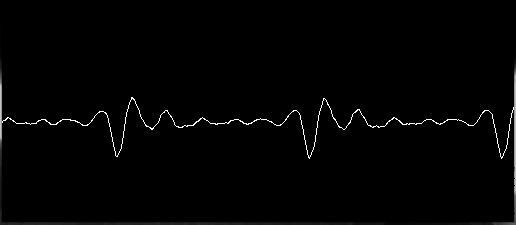

## Theremin.jl

Audio Processing in Julia

#### Goals:
- Provide a simple, intuitive, and very efficient API for audio processing in Julia
- Provides functionalities and efficiencies at the levels of Librosa and Essentia that are quite popular in the audio processing community
- Provides tools for music information retrieval

#### Features:
 - `load_aud` : load audio files in atleast OGG,FLAC, WAV 
 - `mono` : convert audio to mono from multichannel
 - `resample` : resamples audio to a new sampling rate
 - `getduration` : get duration of a audio (would like to implement something like a audio metadata fetchers)
 - `getsamplerate` : get sampling rate of an audio
 - `getnframes` : get number of frames in a audio
 - `trim` : trim audio to a particular range
 - `addsilence` : add silence to an audio
 - `addnoise` : add noise to an audio

Lot more to come...

#### References:
- [DSP.jl](https://github.com/JuliaDSP/DSP.jl) -> https://github.com/JuliaDSP/DSP.jl
- https://github.com/JuliaDSP/MFCC.jl
- https://musicinformationretrieval.com/

